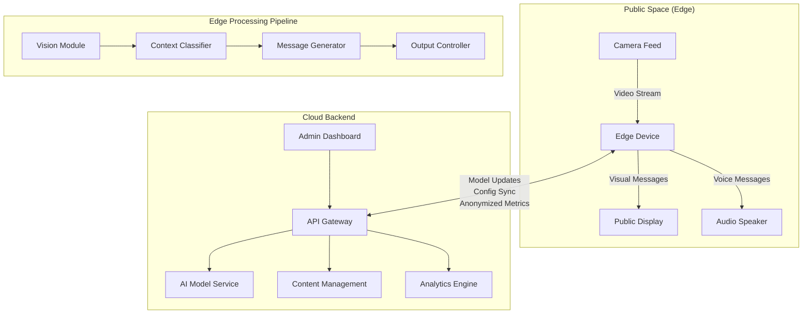
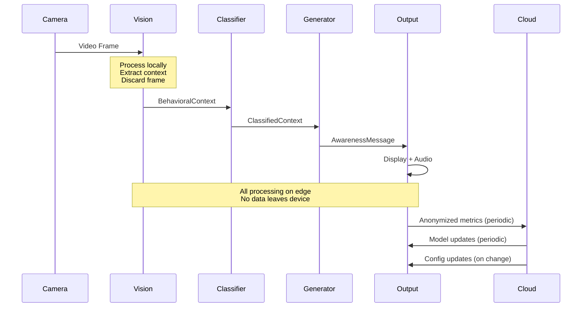

# Design Document: AI-Powered Civic Awareness & Responsibility System

## Overview

The AI-Powered Civic Awareness & Responsibility System is a distributed, privacy-first platform that promotes civic responsibility through contextual awareness messaging. The system operates on an edge-cloud hybrid architecture where Edge Devices perform real-time visual context detection locally, while a Cloud Backend manages AI models, content, and analytics.

The core design principle is privacy by architecture: no personal data leaves the edge, no facial recognition is performed, and all visual processing happens locally with immediate data disposal. The system detects behavioral contexts (e.g., littering, traffic violations) and generates culturally appropriate, multilingual awareness messages delivered through public displays and speakers.

Key design goals:
- **Privacy-first**: Zero personal data collection, local-only visual processing
- **Low latency**: Sub-5-second end-to-end response from detection to message delivery
- **Scalability**: Support 100+ edge locations per cloud instance
- **Reliability**: Offline-capable edge devices with graceful degradation
- **Accessibility**: Multilingual text and voice output for diverse communities

## Architecture

The system follows a three-tier edge-cloud architecture:



### Tier 1: Edge Devices
- Deployed in public spaces (streets, parks, transit stations)
- Perform all visual processing locally
- Run lightweight AI models for context detection
- Generate and deliver messages independently
- Queue analytics for cloud sync when online
- Operate offline using cached models and templates

### Tier 2: Cloud Backend
- Centralized AI model management and updates
- Content management system for message templates
- Aggregated analytics and reporting
- Admin dashboard for monitoring and configuration
- Model training and optimization pipeline

### Tier 3: Admin Interface
- Web-based dashboard for system operators
- Real-time monitoring of edge device health
- Content and template management
- Analytics visualization and reporting
- Configuration management

## Components and Interfaces

### 1. Edge Device Components

#### Vision Module
**Responsibility**: Process camera feeds and extract behavioral context without identifying individuals.

**Interface**:
```typescript
interface VisionModule {
  // Process video frame and extract behavioral context
  processFrame(frame: VideoFrame): BehavioralContext | null;
  
  // Configure detection sensitivity and categories
  configure(config: VisionConfig): void;
  
  // Get current processing metrics
  getMetrics(): VisionMetrics;
}

interface BehavioralContext {
  category: CivicBehaviorCategory;  // e.g., "littering", "traffic_violation"
  confidence: number;                // 0.0 to 1.0
  location: string;                  // Edge device location ID
  timestamp: number;                 // Unix timestamp
  severity: "low" | "medium" | "high";
  // NO personal identifiers, NO image data
}

interface VisionConfig {
  categories: CivicBehaviorCategory[];
  confidenceThreshold: number;
  processingFPS: number;
}
```

**Key Design Decisions**:
- Frame processing at 10+ FPS for real-time detection
- Immediate frame disposal after context extraction
- No frame buffering or storage
- Confidence thresholding to reduce false positives
- Category-based classification (not person-based)

#### Context Classifier
**Responsibility**: Classify detected behavioral contexts into predefined civic behavior categories and prioritize them.

**Interface**:
```typescript
interface ContextClassifier {
  // Classify behavioral context into civic categories
  classify(context: BehavioralContext): ClassifiedContext;
  
  // Prioritize multiple concurrent contexts
  prioritize(contexts: ClassifiedContext[]): ClassifiedContext[];
  
  // Update classification model
  updateModel(model: ClassificationModel): void;
}

interface ClassifiedContext extends BehavioralContext {
  category: CivicBehaviorCategory;
  priority: number;  // Higher = more urgent
  suggestedLanguages: string[];
}

type CivicBehaviorCategory = 
  | "littering"
  | "traffic_violation"
  | "noise_disturbance"
  | "public_safety"
  | "cleanliness"
  | "parking_violation"
  | "smoking_in_restricted_area"
  | "general_awareness";
```

#### Message Generator
**Responsibility**: Generate contextually appropriate, culturally sensitive awareness messages in multiple languages.

**Interface**:
```typescript
interface MessageGenerator {
  // Generate awareness message for a classified context
  generateMessage(context: ClassifiedContext, language: string): AwarenessMessage;
  
  // Generate voice synthesis for message
  synthesizeVoice(message: AwarenessMessage): AudioBuffer;
  
  // Update message templates and AI model
  updateTemplates(templates: MessageTemplate[]): void;
  updateModel(model: GenerationModel): void;
}

interface AwarenessMessage {
  id: string;
  text: string;
  language: string;
  category: CivicBehaviorCategory;
  tone: "informative" | "reminder" | "educational";
  displayDuration: number;  // seconds
  audioEnabled: boolean;
}

interface MessageTemplate {
  category: CivicBehaviorCategory;
  language: string;
  templates: string[];  // Multiple variations
  tone: string;
}
```

**Key Design Decisions**:
- Template-based generation with AI variation to prevent repetition
- Fallback to pre-approved templates if AI generation fails
- Cultural adaptation based on location configuration
- Non-punitive, educational tone enforcement
- Message variation to maintain engagement

#### Output Controller
**Responsibility**: Coordinate message delivery across visual displays and audio speakers with synchronization.

**Interface**:
```typescript
interface OutputController {
  // Deliver message to available output channels
  deliverMessage(message: AwarenessMessage): DeliveryResult;
  
  // Manage message queue to prevent overflow
  queueMessage(message: AwarenessMessage): void;
  
  // Configure output channels
  configureOutputs(config: OutputConfig): void;
  
  // Get current output status
  getStatus(): OutputStatus;
}

interface DeliveryResult {
  messageId: string;
  visualDelivered: boolean;
  audioDelivered: boolean;
  timestamp: number;
  errors?: string[];
}

interface OutputConfig {
  maxConcurrentMessages: number;  // Default: 3
  displayDuration: number;         // seconds
  audioVolume: number;             // 0-100
  ambientNoiseAdjustment: boolean;
  enabledChannels: ("visual" | "audio")[];
}
```

### 2. Cloud Backend Components

#### API Gateway
**Responsibility**: Provide secure REST API for edge devices and admin dashboard.

**Interface**:
```typescript
interface APIGateway {
  // Edge device endpoints
  POST /api/v1/devices/register
  GET  /api/v1/devices/{id}/config
  POST /api/v1/devices/{id}/metrics
  GET  /api/v1/devices/{id}/models
  
  // Content management endpoints
  GET  /api/v1/templates
  POST /api/v1/templates
  PUT  /api/v1/templates/{id}
  
  // Analytics endpoints
  GET  /api/v1/analytics/summary
  GET  /api/v1/analytics/contexts
  GET  /api/v1/analytics/devices
  
  // Admin endpoints
  GET  /api/v1/dashboard/health
  POST /api/v1/config/update
}
```

#### AI Model Service
**Responsibility**: Manage, version, and serve AI models for context detection and message generation.

**Interface**:
```typescript
interface AIModelService {
  // Get latest model for edge device
  getModel(deviceId: string, modelType: ModelType): Model;
  
  // Update model version
  deployModel(model: Model, targetDevices: string[]): DeploymentResult;
  
  // Generate message using cloud-based model (fallback)
  generateMessage(context: ClassifiedContext, language: string): AwarenessMessage;
}

type ModelType = "vision" | "classification" | "generation";

interface Model {
  id: string;
  type: ModelType;
  version: string;
  size: number;  // bytes
  checksum: string;
  url: string;
}
```

#### Content Management System
**Responsibility**: Manage message templates, languages, and configuration across all edge devices.

**Interface**:
```typescript
interface ContentManagement {
  // Template management
  createTemplate(template: MessageTemplate): string;
  updateTemplate(id: string, template: MessageTemplate): void;
  deleteTemplate(id: string): void;
  listTemplates(filters: TemplateFilters): MessageTemplate[];
  
  // Language management
  addLanguage(language: LanguageConfig): void;
  updateLanguage(code: string, config: LanguageConfig): void;
  
  // Configuration management
  updateDeviceConfig(deviceId: string, config: DeviceConfig): void;
  updateGlobalConfig(config: GlobalConfig): void;
}

interface LanguageConfig {
  code: string;  // ISO 639-1
  name: string;
  voiceModel: string;
  enabled: boolean;
}

interface DeviceConfig {
  location: string;
  languages: string[];
  categories: CivicBehaviorCategory[];
  outputConfig: OutputConfig;
  customTemplates?: MessageTemplate[];
}
```

#### Analytics Engine
**Responsibility**: Aggregate anonymized metrics, generate reports, and identify trends.

**Interface**:
```typescript
interface AnalyticsEngine {
  // Ingest anonymized metrics from edge devices
  ingestMetrics(deviceId: string, metrics: DeviceMetrics): void;
  
  // Generate reports
  generateDailyReport(date: string): AnalyticsReport;
  getTrendAnalysis(category: CivicBehaviorCategory, period: TimePeriod): TrendData;
  
  // Real-time queries
  getSystemHealth(): SystemHealth;
  getContextFrequency(filters: AnalyticsFilters): ContextFrequency[];
}

interface DeviceMetrics {
  deviceId: string;
  timestamp: number;
  contextsDetected: ContextCount[];
  messagesDelivered: number;
  deliverySuccessRate: number;
  averageLatency: number;
  uptime: number;
}

interface ContextCount {
  category: CivicBehaviorCategory;
  count: number;
  // NO individual event data, only aggregated counts
}

interface AnalyticsReport {
  date: string;
  totalContexts: number;
  totalMessages: number;
  categoryBreakdown: Record<CivicBehaviorCategory, number>;
  deviceHealth: DeviceHealthSummary[];
  topLocations: LocationStats[];
}
```

## Data Models

### Core Data Structures

#### BehavioralContext (Edge Only)
```typescript
interface BehavioralContext {
  category: CivicBehaviorCategory;
  confidence: number;
  location: string;
  timestamp: number;
  severity: "low" | "medium" | "high";
}
```
**Privacy Note**: This structure contains NO personal identifiers, NO image data, NO tracking information. It exists only in memory on the edge device and is never stored or transmitted in raw form.

#### AwarenessMessage
```typescript
interface AwarenessMessage {
  id: string;
  text: string;
  language: string;
  category: CivicBehaviorCategory;
  tone: "informative" | "reminder" | "educational";
  displayDuration: number;
  audioEnabled: boolean;
}
```

#### MessageTemplate
```typescript
interface MessageTemplate {
  id: string;
  category: CivicBehaviorCategory;
  language: string;
  templates: string[];
  tone: string;
  createdAt: number;
  updatedAt: number;
}
```

#### DeviceMetrics (Anonymized)
```typescript
interface DeviceMetrics {
  deviceId: string;
  timestamp: number;
  contextsDetected: ContextCount[];
  messagesDelivered: number;
  deliverySuccessRate: number;
  averageLatency: number;
  uptime: number;
}
```
**Privacy Note**: Only aggregated counts are transmitted to the cloud. No individual context events, no timestamps of specific detections, no data that could be used for re-identification.

### Data Flow



### Storage Requirements

#### Edge Device Storage
- **AI Models**: 100-500 MB per model (vision, classification, generation)
- **Message Templates**: 1-5 MB (all languages)
- **Configuration**: < 1 MB
- **Metrics Queue**: 10-50 MB (pending cloud sync)
- **Total**: ~1 GB storage per edge device

#### Cloud Storage
- **Models Repository**: 10-50 GB (versioned models)
- **Templates Database**: 100 MB - 1 GB
- **Anonymized Analytics**: 10-100 GB (time-series data)
- **Configuration**: < 100 MB
- **Logs**: 1-10 GB (system logs, audit trails)

**Privacy Guarantee**: No visual data, no personal identifiers, no individual event logs stored anywhere in the system.

## Correctness Properties


*A property is a characteristic or behavior that should hold true across all valid executions of a system—essentially, a formal statement about what the system should do. Properties serve as the bridge between human-readable specifications and machine-verifiable correctness guarantees.*

### Property 1: Context Classification Validity
*For any* detected behavioral context, the classified category must be one of the predefined civic behavior categories in the system configuration.
**Validates: Requirements 1.3**

### Property 2: Privacy - No Personal Identifiers
*For any* context detection output, the data structure must contain no facial recognition data, no biometric identifiers, no person tracking IDs, and no personally identifiable information.
**Validates: Requirements 1.2, 5.3, 5.4, 9.2**

### Property 3: Context Prioritization Ordering
*For any* set of multiple detected contexts, the prioritized output list must be ordered by severity (high > medium > low) and then by relevance score in descending order.
**Validates: Requirements 1.5**

### Property 4: Message Generation Latency
*For any* classified behavioral context, the system must generate and deliver an awareness message within 5 seconds end-to-end from detection to output.
**Validates: Requirements 2.1, 6.1**

### Property 5: Message Variation on Repetition
*For any* behavioral context that repeats N times (N > 3), the generated messages must have at least 70% unique content to maintain engagement.
**Validates: Requirements 2.4**

### Property 6: Fallback Message on Generation Failure
*For any* message generation failure, the system must return a pre-approved fallback message from the template library matching the context category.
**Validates: Requirements 2.5**

### Property 7: Multi-Channel Message Delivery
*For any* awareness message, if visual output is available, the message must be displayed on screens, and if audio output is enabled, the message must be broadcast through speakers.
**Validates: Requirements 3.1, 3.2**

### Property 8: Output Synchronization
*For any* message with both visual and audio outputs enabled, the visual display and audio broadcast must start within 200ms of each other.
**Validates: Requirements 3.3**

### Property 9: Message Queue Limit Invariant
*For any* point in time during system operation, the number of concurrent messages being delivered must never exceed 3.
**Validates: Requirements 3.4**

### Property 10: Offline Operation Continuity
*For any* edge device, when network connectivity is lost, the device must continue detecting contexts and delivering messages using cached models and templates without degradation.
**Validates: Requirements 3.5, 8.1**

### Property 11: Multilingual Support Completeness
*For any* deployment location, the system must support message generation and voice synthesis in all configured languages (minimum 5 languages).
**Validates: Requirements 4.1, 4.2, 4.3**

### Property 12: Language Rotation Fairness
*For any* sequence of N messages (N ≥ number of configured languages), each configured language must be used at least once to ensure broader reach.
**Validates: Requirements 4.4**

### Property 13: Configuration Update Propagation
*For any* language preference update, the changes must be applied to all edge devices within 1 minute.
**Validates: Requirements 4.5**

### Property 14: No Visual Data Storage
*For any* video frame processed by the edge device, the frame must be discarded from memory within 100ms after context extraction, and no visual data must exist in persistent storage.
**Validates: Requirements 5.1**

### Property 15: Frame Processing Rate
*For any* edge device under normal operation, the context detector must process video frames at a minimum rate of 10 FPS.
**Validates: Requirements 6.2**

### Property 16: Offline Mode Activation
*For any* edge device, when network latency exceeds 500ms for 3 consecutive requests, the device must switch to offline mode using local models.
**Validates: Requirements 6.4**

### Property 17: Concurrent Load Performance
*For any* edge device location, the system must maintain response times under 5 seconds when processing up to 50 concurrent context detections.
**Validates: Requirements 6.5**

### Property 18: Cloud Scalability
*For any* cloud backend instance, the system must support at least 100 connected edge devices without degrading message generation latency beyond 2 seconds.
**Validates: Requirements 7.1, 7.3**

### Property 19: Device Provisioning Time
*For any* new edge device registration, the system must complete provisioning and configuration within 10 minutes.
**Validates: Requirements 7.2**

### Property 20: Location Isolation
*For any* set of edge devices at different locations, context detection at one location must not affect or interfere with context detection at other locations.
**Validates: Requirements 7.4**

### Property 21: Auto-Scaling Response
*For any* cloud backend, when system load increases by 50% or more, the AI model serving capacity must auto-scale within 5 minutes.
**Validates: Requirements 7.5**

### Property 22: Analytics Data Queuing
*For any* edge device, when the cloud backend is unavailable, analytics data must be queued locally and transmitted once connectivity is restored without data loss.
**Validates: Requirements 8.2**

### Property 23: Device Failure Alerting
*For any* edge device failure, the system must send an alert to operators within 2 minutes of detecting the failure.
**Validates: Requirements 8.3**

### Property 24: Graceful Degradation
*For any* hardware component failure (display or speaker), the system must continue operating by disabling only the affected output channel while maintaining functionality of other channels.
**Validates: Requirements 8.4**

### Property 25: Category Opt-Out Configuration
*For any* deployment location, administrators must be able to configure opt-out of specific message categories, and the system must respect these opt-outs when generating messages.
**Validates: Requirements 9.5**

### Property 26: Anonymized Event Logging
*For any* detected context, the system must log an anonymized event count by category and location without storing individual event details or timestamps that could enable re-identification.
**Validates: Requirements 10.1**

### Property 27: Delivery Metrics Tracking
*For any* message delivery attempt, the system must record success/failure status and channel utilization metrics.
**Validates: Requirements 10.2**

### Property 28: Daily Report Generation
*For any* calendar day, the system must generate a daily report containing context detection frequency, message delivery stats, and system health metrics.
**Validates: Requirements 10.3**

### Property 29: Dashboard Data Completeness
*For any* dashboard query, the system must provide real-time data for system health, message delivery statistics, and context detection metrics for all connected devices.
**Validates: Requirements 10.5**

### Property 30: Template Update Propagation
*For any* message template update by administrators, the changes must propagate to all edge devices within 5 minutes.
**Validates: Requirements 11.1**

### Property 31: Per-Location Message Overrides
*For any* location with custom message overrides configured, the system must use the location-specific messages instead of global templates for matching contexts.
**Validates: Requirements 11.2**

### Property 32: Dynamic Category Configuration
*For any* new civic behavior category added to the system, edge devices must support the new category without requiring redeployment or restart.
**Validates: Requirements 11.3**

### Property 33: Configuration Validation
*For any* configuration change (templates, languages, categories), the system must validate the change for correctness before deployment and reject invalid configurations with descriptive error messages.
**Validates: Requirements 11.5**

### Property 34: Display Font Size Compliance
*For any* visual message displayed, the font size must be at least 72pt to ensure visibility from 10 meters.
**Validates: Requirements 12.1**

### Property 35: Minimum Display Duration
*For any* visual message, the display duration must be at least 8 seconds to ensure readability.
**Validates: Requirements 12.4**

### Property 36: Ambient Noise Volume Adjustment
*For any* audio message, when ambient noise exceeds 70dB, the system must increase audio volume proportionally up to safe limits (maximum 85dB).
**Validates: Requirements 12.5**

## Error Handling

### Edge Device Error Handling

**Vision Module Errors**:
- **Camera failure**: Log error, alert operators, continue with other edge functions
- **Low confidence detection**: Discard context if confidence < threshold, no message generation
- **Frame processing timeout**: Skip frame, continue with next frame, log performance degradation

**Context Classification Errors**:
- **Unknown category**: Map to "general_awareness" category, log for review
- **Model inference failure**: Use rule-based fallback classifier, alert for model update

**Message Generation Errors**:
- **AI generation timeout**: Use pre-approved template for category
- **Template not found**: Use generic awareness message, log missing template
- **Language not available**: Fall back to primary language (English), log language gap

**Output Delivery Errors**:
- **Display hardware failure**: Disable visual output, continue audio delivery, alert operators
- **Speaker failure**: Disable audio output, continue visual delivery, alert operators
- **Both outputs failed**: Log error, queue message for retry, alert operators immediately

**Network Errors**:
- **Connection loss**: Switch to offline mode, queue analytics, continue local operation
- **Intermittent connectivity**: Implement exponential backoff for retries
- **Model download failure**: Continue with cached models, retry download periodically

### Cloud Backend Error Handling

**API Gateway Errors**:
- **Invalid request**: Return 400 with validation errors
- **Authentication failure**: Return 401, log security event
- **Rate limiting**: Return 429, implement backoff on edge device
- **Internal error**: Return 500, log for investigation, alert on-call

**Model Service Errors**:
- **Model not found**: Return latest stable version, log missing model
- **Model corruption**: Rollback to previous version, alert for investigation
- **Inference timeout**: Return cached result or error, scale up capacity

**Content Management Errors**:
- **Template validation failure**: Reject update, return validation errors
- **Concurrent update conflict**: Use optimistic locking, retry with latest version
- **Database unavailable**: Return cached data, queue writes, alert operators

**Analytics Engine Errors**:
- **Metrics ingestion failure**: Queue metrics for retry, log error
- **Report generation timeout**: Generate partial report, mark as incomplete
- **Storage full**: Archive old data, alert operators, implement retention policy

### Error Recovery Strategies

**Automatic Recovery**:
- Retry with exponential backoff for transient failures
- Automatic failover to cached/fallback resources
- Self-healing through model reloading and cache refresh
- Graceful degradation by disabling failed components

**Manual Intervention Required**:
- Hardware failures (camera, display, speaker)
- Persistent model corruption
- Configuration errors requiring admin review
- Security incidents

**Monitoring and Alerting**:
- Real-time error rate monitoring per component
- Automatic alerts for critical failures (< 2 minutes)
- Daily error summary reports
- Anomaly detection for unusual error patterns

## Testing Strategy

### Dual Testing Approach

The system will be validated using both unit tests and property-based tests, which are complementary and both necessary for comprehensive coverage:

- **Unit tests**: Verify specific examples, edge cases, and error conditions
- **Property-based tests**: Verify universal properties across all inputs

Together, these approaches provide comprehensive coverage where unit tests catch concrete bugs and property-based tests verify general correctness.

### Property-Based Testing

We will use **fast-check** (for TypeScript/JavaScript components) and **Hypothesis** (for Python components if any) as our property-based testing libraries.

**Configuration**:
- Minimum 100 iterations per property test (due to randomization)
- Each property test must reference its design document property
- Tag format: **Feature: civic-awareness-system, Property {number}: {property_text}**

**Property Test Coverage**:
Each of the 36 correctness properties defined above must be implemented as a property-based test. The tests will:
- Generate random valid inputs (contexts, messages, configurations)
- Verify the property holds across all generated inputs
- Use smart generators that constrain to valid input spaces
- Avoid mocking where possible to test real functionality

**Example Property Test Structure**:
```typescript
// Feature: civic-awareness-system, Property 1: Context Classification Validity
test('detected contexts must have valid categories', () => {
  fc.assert(
    fc.property(
      arbitraryBehavioralContext(),
      (context) => {
        const classified = contextClassifier.classify(context);
        const validCategories = getValidCategories();
        return validCategories.includes(classified.category);
      }
    ),
    { numRuns: 100 }
  );
});
```

### Unit Testing

Unit tests will focus on:
- **Specific examples**: Concrete scenarios demonstrating correct behavior
- **Edge cases**: Empty inputs, boundary values, maximum limits
- **Error conditions**: Invalid inputs, failure scenarios, timeout handling
- **Integration points**: Component interactions, API contracts

**Unit Test Coverage Areas**:
- Vision module frame processing with various input formats
- Context classifier with edge cases (low confidence, unknown patterns)
- Message generator with template variations and fallbacks
- Output controller with channel failures and synchronization
- API endpoints with invalid requests and authentication
- Configuration validation with malformed inputs
- Analytics aggregation with edge cases (zero events, overflow)

**Test Organization**:
- Co-locate tests with source files using `.test.ts` suffix
- Group tests by component and functionality
- Use descriptive test names explaining what is being tested
- Mock external dependencies (camera, network) but not core logic

### Integration Testing

Integration tests will verify:
- End-to-end flow from detection to message delivery
- Edge-cloud communication and synchronization
- Offline mode transitions and recovery
- Multi-device coordination and isolation
- Configuration propagation across system

### Performance Testing

Performance tests will validate:
- Frame processing rate (10+ FPS)
- Message generation latency (< 2 seconds)
- End-to-end latency (< 5 seconds)
- Concurrent load handling (50 contexts)
- Cloud scalability (100+ devices)
- Configuration propagation time (< 5 minutes)

### Privacy and Security Testing

Privacy tests will verify:
- No PII in context detection output
- No visual data in storage or network traffic
- Anonymized analytics data only
- No facial recognition capabilities
- Secure communication channels

### Testing During Development

- Write property tests alongside implementation to catch errors early
- Run unit tests on every code change
- Run property tests before committing code
- Run integration tests in CI/CD pipeline
- Run performance tests weekly and before releases
- Conduct privacy audits before deployment

### Test Data Generation

**Smart Generators for Property Tests**:
- **BehavioralContext generator**: Random categories, confidence levels, timestamps
- **Message generator**: Random text, languages, categories
- **Configuration generator**: Valid device configs, template sets
- **Network condition generator**: Latency, packet loss, disconnections
- **Load generator**: Concurrent contexts, device counts

**Edge Case Generators**:
- Empty inputs, null values
- Boundary values (0, max int, max string length)
- Invalid categories, unsupported languages
- Extreme load conditions
- Hardware failure scenarios

This comprehensive testing strategy ensures the system meets all functional requirements, maintains privacy guarantees, and performs reliably under various conditions.
